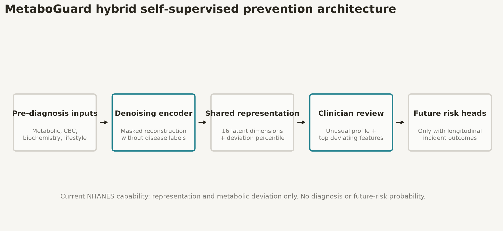

# MetaboGuard Prevention Model Specification

## Clinical purpose

MetaboGuard is a research system for preventive monitoring. It identifies
unusual metabolic profiles and produces reusable patient representations for
future longitudinal validation.

It is not a diagnostic system. A warning means “this profile differs from the
reference and may warrant clinician review,” not “this patient has or will
develop cancer/diabetes.”

## Intended users

- clinical researchers;
- data scientists working with approved health datasets;
- clinicians reviewing research outputs in context;
- patients only through clinician-mediated explanations.

No autonomous patient-facing alerts are permitted in the current version.

## Model layers

### Layer 1: self-supervised encoder

Input:

- demographics;
- body measurements;
- glucose/HbA1c/insulin/C-peptide;
- lipids and inflammation;
- CBC and routine biochemistry;
- smoking, alcohol and weight change.

Training:

- no cancer or diabetes labels;
- 15% random feature masking;
- Gaussian corruption;
- reconstruction objective;
- robust scaling and missingness indicators;
- adult NHANES records.

Output:

- 16-dimensional latent representation;
- reconstruction error;
- latent-distance score;
- combined metabolic-deviation score;
- reference percentile;
- top five deviating source features.

### Layer 2: anomaly/deviation warning

The warning score combines:

- 70% robust-standardised reconstruction error;
- 30% robust-standardised latent distance.

Reference percentiles are empirical percentiles from the training cohort.

Suggested research-only bands:

| Percentile | Label | Interpretation |
| --- | --- | --- |
| <90 | Within reference range | No model warning; not evidence disease is absent |
| 90-95 | Mild deviation | Consider data quality and routine review |
| 95-99 | Elevated deviation | Clinician-reviewed follow-up research |
| ≥99 | High deviation | Strongly unusual profile; still not diagnostic |

These bands are not clinically validated thresholds.

### Layer 3: post-hoc association heads

Labels are introduced only after encoder training to assess representation
content.

Current heads:

- any-cancer prevalence;
- Type 2 diabetes proxy;
- Type 1 proxy, research-only.

No current head is a future-development model because NHANES lacks
patient-level longitudinal outcomes.

### Layer 4: future longitudinal risk heads

When longitudinal data are available:

1. choose prediction times before diagnosis;
2. censor all post-index measurements;
3. evaluate 1-, 3- and 5-year horizons;
4. enable a horizon only with at least 50 events and 50 eligible non-events;
5. validate by site and calendar period;
6. calibrate probabilities separately for each horizon.

The user-selected “custom horizon based on available data” is implemented as
event-count-based horizon eligibility rather than a fixed universal window.

## Dataset governance

### Prevention feature allowlist

Only measurements plausibly available before diagnosis are allowed.

### Denylist

Prohibited:

- cancer diagnosis labels as encoder inputs;
- tumour site, stage, grade or histology;
- treatment response;
- survival/progression events and times;
- post-diagnosis pathology;
- diabetes diagnosis-age or insulin-use variables when evaluating diabetes
  development;
- genetics without project approval.

### Dataset capability states

| State | Allowed outputs |
| --- | --- |
| Cross-sectional only | representation, deviation score, association checks |
| Repeated measurements without outcomes | trajectory embeddings, no disease risk |
| Longitudinal with incident outcomes | eligible multi-horizon risk heads |
| Post-diagnosis cancer cohort | prognosis/context research only |

## Cancer scope

The cancer head is pan-cancer by default. Cancer-site-specific heads require
enough incident cases at the selected horizon. Sites are not pooled blindly if
their biology, screening pathways or treatment histories materially differ.

TCGA can inform cancer heterogeneity and prognosis, but it cannot validate
pre-diagnosis metabolic warnings.

## Diabetes scope

### Type 2

Metabolic early-warning research is feasible with glucose, HbA1c, insulin,
adiposity, lipids and longitudinal outcomes.

### Type 1

Current output is research-only. Patient-facing Type 1 warnings require:

- GAD, IA-2, ZnT8 and/or insulin autoantibodies;
- C-peptide;
- family history;
- longitudinal glucose/HbA1c;
- approved genetics where permitted.

The current proxy must not be described as Type 1 diagnosis or development
risk.

## Evaluation

Representation:

- reconstruction loss;
- latent stability;
- missingness sensitivity;
- subgroup distribution checks.

Deviation score:

- repeat-measurement consistency;
- association with future outcomes only in longitudinal cohorts;
- false-alert burden;
- subgroup alert-rate parity.

Risk heads:

- AUROC;
- AUPRC and lift over prevalence;
- Brier score;
- calibration intercept/slope;
- decision curves;
- temporal and external validation;
- event counts and confidence intervals.

## Current evidence status

The current MetaboGuard-SSL artifact demonstrates technical feasibility:

- 50,000 unlabelled training rows;
- 25 raw features;
- 16 latent dimensions;
- NumPy-only inference;
- feature-level reconstruction explanations.

Cross-sectional association checks must not be interpreted as future
development performance.

## Release policy

An artifact may be shared for representation benchmarking if its model card
states that it is non-diagnostic and cross-sectional.

A disease-risk artifact may not be published until:

- the endpoint is independently verified;
- longitudinal index/outcome timing is defined;
- event thresholds are met;
- leakage audits pass;
- temporal/external validation is complete;
- Type 1 biomarker/genetic governance is approved where applicable.
