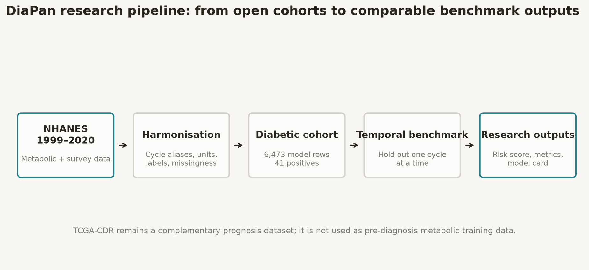
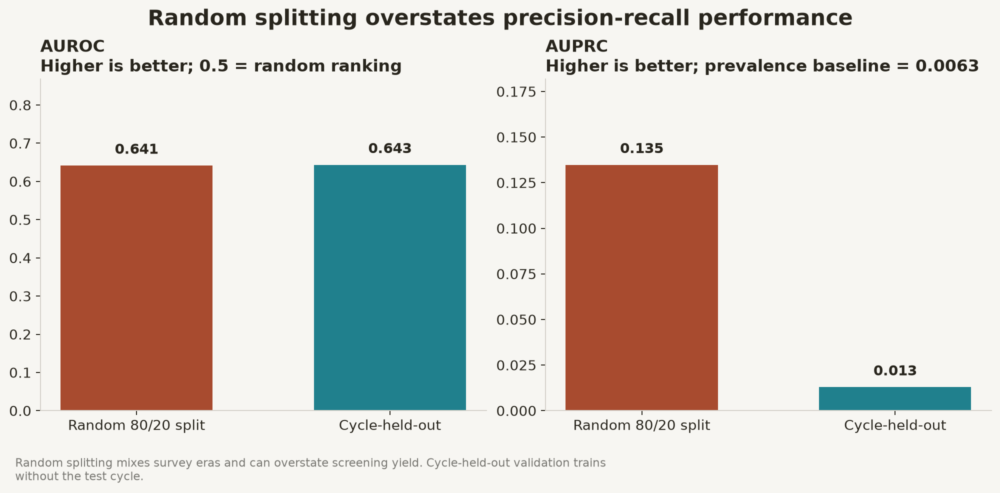
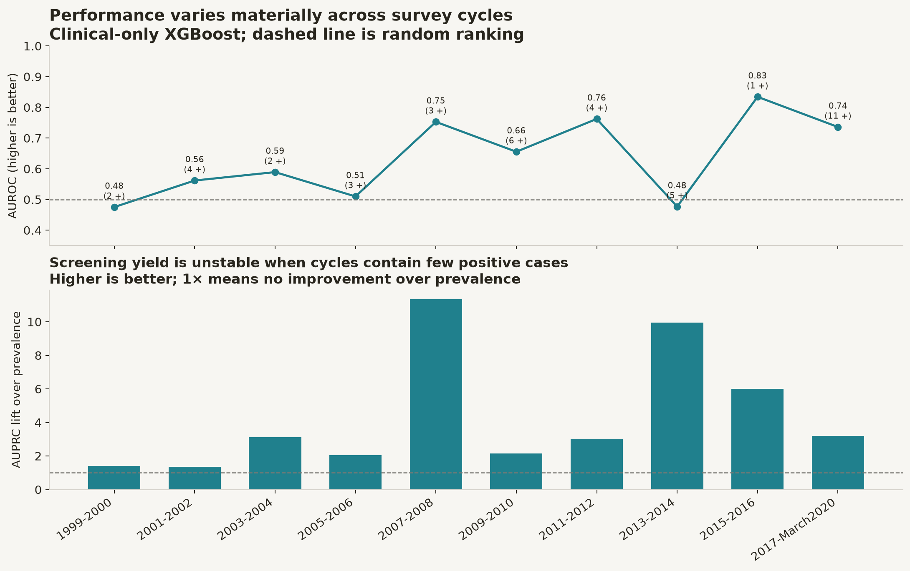

# DiaPan Results and Terminology Guide

## The short version

DiaPan is a **research ranking model**, not a clinical diagnostic test. It asks:

> Among people with diabetes in NHANES, can metabolic and demographic features
> rank self-reported pancreatic-cancer cases above non-cases?

The most credible benchmark is leave-one-survey-cycle-out validation, because
every person is tested by a model that did not train on their survey era.

## Is higher better?

| Output | Meaning | Is higher better? |
| --- | --- | --- |
| **AUROC** | Ranking discrimination across all thresholds | **Yes.** 0.5 is random; 1.0 is perfect ranking |
| **AUPRC** | Precision-recall performance for the rare positive class | **Yes**, but compare it with prevalence |
| **AUPRC lift** | AUPRC divided by positive-class prevalence | **Yes.** 1× means no improvement over prevalence |
| **Brier score** | Mean squared error of probability-like scores | **No. Lower is better.** 0 is perfect |
| **Research risk score** | Relative model-assigned pancreatic-cancer risk | Higher means higher relative model score, **not absolute clinical probability** |
| **Feature importance** | How much a feature helped model performance | Larger magnitude means more influence; it does not imply causality |
| **Mean shift** | Positive-class mean minus negative-class mean | Positive means higher among cases; negative means lower among cases |
| **95% confidence interval** | Range produced by repeated resampling | Narrower is more precise; it is not a performance score |

## Which result should be quoted?

Use the **clinical-only XGBoost cycle-held-out result**:

- AUROC: **0.643** (cycle-bootstrap 95% CI 0.561-0.703)
- AUPRC: **0.0128** (0.0084-0.0289)
- AUPRC lift: **2.03×**
- Brier score: **0.0123**
- Validation positives: **41**

Do not quote the random 80/20 AUPRC of 0.135 as generalisation performance.
Random splitting mixes survey periods and produces a much more optimistic
precision-recall result.

## Why AUROC and AUPRC tell different stories

Pancreatic cancer is extremely rare in the diabetic cohort: prevalence is
approximately 0.0063, or 0.63%. A model can rank cases reasonably well
(moderate AUROC) while still producing many false positives (low AUPRC).

An AUPRC of 0.0128 looks small, but it is about twice the prevalence baseline.
That means the model enriches cases relative to random selection, but the yield
is still too low for clinical use.

## Model benchmark

All models below use the same clinical-only features and leave-one-cycle-out
folds.

| Model | AUROC | AUPRC | Lift | Brier | Interpretation |
| --- | ---: | ---: | ---: | ---: | --- |
| **XGBoost** | **0.643** | 0.0128 | 2.03× | 0.0123 | Best ranking discrimination; selected artifact |
| HistGradientBoosting | 0.635 | 0.0119 | 1.88× | Similar but slightly weaker ranking |
| Random Forest | 0.629 | 0.0184 | 2.91× | Better AUPRC and Brier, lower AUROC |
| Balanced Logistic Regression | 0.601 | **0.0347** | **5.49×** | Highest AUPRC but Brier 0.1996 shows badly distorted probability scores |

There is no universally best model. XGBoost is selected because the project
prioritises stable ranking discrimination and its probability error is much
lower than balanced Logistic Regression. Random Forest remains a credible
alternative for future calibration work.

## Survey-cycle stability

The number in parentheses above each AUROC point is the number of pancreatic
cancer positives in that held-out cycle. Cycles with one to five positive cases
produce unstable estimates. Large differences between cycles indicate temporal
dataset shift and measurement heterogeneity.

## Core terminology

| Term | Plain-English meaning |
| --- | --- |
| **Positive case** | Participant whose self-reported cancer site includes pancreas code 39 |
| **Negative case** | Participant with a known cancer-history response but no pancreatic site |
| **Prevalence** | Fraction of labelled participants who are positive |
| **Training fold** | Cycles used to learn imputation values and model parameters |
| **Held-out cycle** | Entire survey period excluded from training and used only for testing |
| **Temporal validation** | Testing on a different data-collection period |
| **Imputation** | Replacing a missing value with the training-set median |
| **Class weighting** | Penalising mistakes on rare positive cases more heavily |
| **Discrimination** | Ability to rank positives above negatives |
| **Calibration** | Agreement between predicted probabilities and observed frequency |
| **Data leakage** | Test or outcome information entering model training |
| **Reverse causation** | Cancer may have already affected metabolism before NHANES measurement |
| **Trajectory proxy** | Cross-sectional interaction that approximates temporal context, not repeated measurements of one person |
| **Fold** | One train/test iteration in cross-validation |

## Feature direction is not causation

If a feature is marked `higher_in_positive`, its mean was higher among positive
cases in that test sample. This does not mean increasing the feature causes
pancreatic cancer. The relationship may reflect age, existing disease,
treatment, missingness, measurement changes or confounding.

Interaction columns such as `hba1c_age_interaction` have no simple clinical
unit. Their importance means the combination helped prediction, not that the
product itself is a recognised biomarker.

## What the model score does not mean

A score of 0.02 does **not** mean a patient has a 2% clinically validated chance
of pancreatic cancer. Class weighting, rare outcomes and temporal drift mean
the score should currently be used only to rank research records under an
identical pipeline.

No diagnosis, reassurance, referral or treatment decision should be based on
the score.

## Related documentation

- `COLUMN_DICTIONARY.md`: raw and derived column meanings
- `METHODOLOGY.md`: study design and decision rationale
- `CYCLE_HOLDOUT_VALIDATION.md`: every temporal fold
- `RESEARCH_EVIDENCE.md`: source-cited literature review
- `model_artifacts/huggingface/diapan-risk-xgboost/README.md`: public model card
