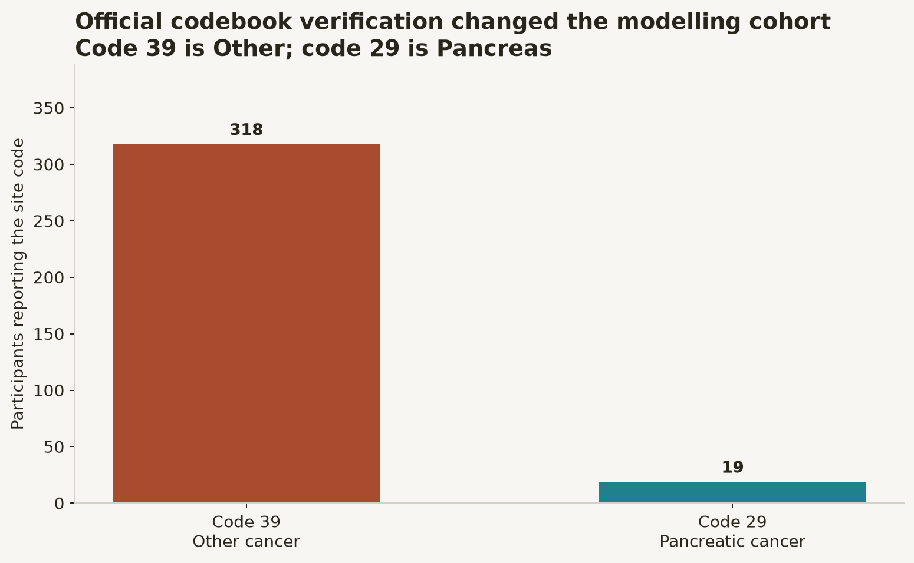
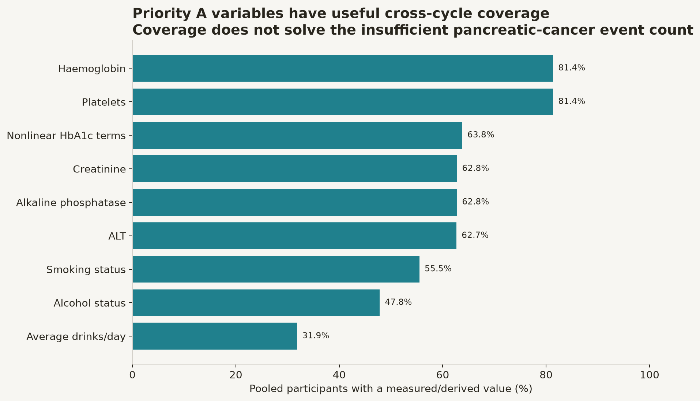

# MetaboGuard Results and Terminology Guide

## Current status

MetaboGuard has a valid **self-supervised representation/deviation artifact**,
but does **not currently have a validated future cancer or diabetes risk
model**.

The current artifact may be used to:

- generate latent metabolic representations;
- calculate deviation percentiles;
- identify measurements contributing to reconstruction deviation;
- benchmark unsupervised tabular representations.

It must not be described as predicting future development from current NHANES
data.

## Self-supervised artifact

| Item | Result |
| --- | ---: |
| Unlabelled training rows | 50,000 |
| Raw features | 25 |
| Latent dimensions | 16 |
| Validation reconstruction loss | 0.0565 |

Post-hoc cross-sectional association checks:

| Label | AUROC | AUPRC | Interpretation |
| --- | ---: | ---: | --- |
| Any-cancer prevalence | 0.699 | 0.169 | Representation association only |
| Type 2 diabetes proxy | 0.923 | 0.675 | Current-state association only |
| Type 1 proxy | 0.909 | 0.135 | Unvalidated research proxy |

These values are not development-risk performance.

## Pancreatic model invalidation

An audit against the official NHANES codebook found that the first pooled
dataset used MCQ230 code 39 as pancreatic cancer. The official coding is:

- **29 = Pancreas (pancreatic)**
- **39 = Other**

The former metrics and `MetaboGuard-XGB v1` artifact are invalid and must not be
quoted, benchmarked, published or used for inference.

## Corrected cohort

The corrected `nhanes_multicycle_v2.csv` contains:

| Definition | Positive cases |
| --- | ---: |
| Pancreatic cancer across the pooled population | 19 |
| Pancreatic cancer among participants with diabetes | 7 |
| Usable diabetic positives after required-field cleaning | 6 |
| Pancreatic cancer diagnosed 0-3 years after diabetes | 2 |

These event counts are too small for train/test splitting, calibration,
temporal validation or model comparison.

## Safety behaviour

MetaboGuard now:

1. Excludes `nhanes_multicycle.csv` and `nhanes_merged.csv` from API discovery.
2. Uses the versioned corrected datasets ending in `_v2.csv`.
3. Requires at least 20 usable positive and 20 usable negative cases.
4. Stores a SHA-256 dataset signature in every new artifact.
5. Retrains or refuses inference when the dataset signature changes.
6. Blocks public model export when the corrected cohort is underpowered.

## Priority A variables now available

| Variable | MetaboGuard field | Coverage in pooled cohort |
| --- | --- | ---: |
| Smoking status | `smoking_status` | 59,745 |
| Current smoker | `current_smoker` | 59,745 |
| Alcohol status | `alcohol_status` | 51,467 |
| Average drinks/day | `average_drinks_per_day` | 34,282 |
| Haemoglobin | `CBC_LBXHGB` | 87,554 |
| Platelet count | `CBC_LBXPLTSI` | 87,552 |
| ALT | `BIOPRO_LBXSATSI` | 67,442 |
| Alkaline phosphatase | `BIOPRO_LBXSAPSI` | 67,536 |
| Creatinine | `BIOPRO_LBXSCR` | 67,542 |
| Reciprocal HbA1c term | `hba1c_reciprocal_100` | 68,644 |
| Squared HbA1c term | `hba1c_squared` | 68,644 |

These variables improve the feature schema but cannot compensate for only six
usable positive diabetic pancreatic-cancer cases.

## Is higher better?

| Output | Meaning | Direction |
| --- | --- | --- |
| AUROC | Ranking discrimination | Higher is better; 0.5 is random |
| AUPRC | Precision-recall performance | Higher is better; compare with prevalence |
| AUPRC lift | AUPRC divided by prevalence | Higher is better; 1× is baseline |
| Brier score | Squared probability error | Lower is better |
| Feature importance | Model dependence on a feature | Larger means more influence, not causality |

No corrected pancreatic-risk values are currently reported for these metrics.

## What is still valid

- TCGA-CDR prognosis experiments remain separate and are unaffected by the
  NHANES site-code correction.
- NHANES diabetes and any-cancer descriptive analyses remain available.
- The corrected v2 datasets and variable-coverage audit are valid.
- The paper-derived genetic, protein and metabolite candidate catalogues remain
  valid research inputs.

## Required next dataset

The brief requires a cohort containing:

- a sufficiently large incident pancreatic-cancer endpoint;
- exact diabetes and cancer diagnosis dates;
- at least 20 positive cases for exploratory fitting, preferably far more;
- repeated HbA1c, glucose, BMI and weight measurements;
- smoking and routine blood tests;
- ideally genotype, CA19-9 and/or the prioritised serum proteins.

UK Biobank or an equivalent linked clinical/genetic cohort is required for the
primary MetaboGuard model. NHANES should remain a feature-engineering and
population-context dataset.

## How to read each output (2026-08-04 terminology contract)

| Output | What it is | What it is not | Safe sentence |
| --- | --- | --- | --- |
| `metabolic_deviation_score` | Distance of a profile from the training reference (0.7 × reconstruction + 0.3 × latent distance, both robust-scaled) | A probability, a severity grade, or a diagnosis | "This profile is unusual relative to our reference sample." |
| `reference_percentile` | Rank of that score inside the **training** reference distribution | A population percentile (survey weights are not applied) | "It sits above the 95th percentile of our training reference." |
| `latent_representation` | 16 learned numbers summarising the inputs | Interpretable biology; individual dimensions have no assigned meaning | "It is the encoding we use for downstream research." |
| `top_deviation_features` | Features contributing most to reconstruction error | Causes, or clinically abnormal values | "Most of the unusualness comes from HbA1c and triglycerides." |
| `cross_sectional_association_probability` | Probability that someone with this profile **already has** a recorded diagnosis in NHANES | A future-risk probability; a screening result | "Profiles like this are more common among people who already report a diagnosis." |
| Post-hoc AUROC / AUPRC | Separation of **prevalent** cases on the holdout partition | Prevention or early-warning performance | "The representation carries cross-sectional signal." |
| Baseline reconstruction MSE | How well an unsupervised method models the feature distribution | Disease prediction skill | "The encoder models the data slightly better than a matched PCA." |
| Flag Jaccard between methods | Overlap of the top-5 % most-unusual profiles | Agreement about disease | "Which profiles look unusual depends on the method, so clinicians adjudicate." |

Deprecated: `cancer_risk_probability` is retained for one release as an alias of
`cross_sectional_association_probability`. Do not quote it; the name implies future
risk the data cannot support.

Gated off entirely: any 1/3/5-year horizon output. `/api/v1/prevention-future-risk`
returns HTTP 409 with the event-count gate report, and
`prevention-capabilities.longitudinal_heads_enabled` is `false`.
